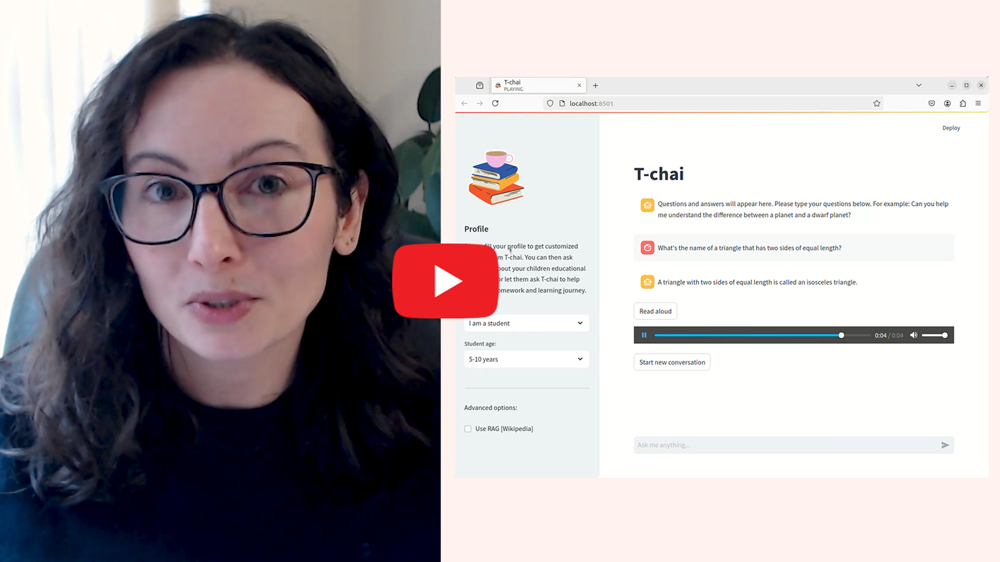

[](https://www.apache.org/licenses/LICENSE-2.0) [](https://developer.ibm.com/callforcode/solutions/projects/get-started/)

# T-chai

- [Project summary](#project-summary)
  - [The issue we are hoping to solve](#the-issue-we-are-hoping-to-solve)
  - [How our technology solution can help](#how-our-technology-solution-can-help)
  - [Our idea](#our-idea)
- [Technology implementation](#technology-implementation)
  - [IBM watsonx product(s) used](#ibm-ai-services-used)
  - [Other IBM technology used](#other-ibm-technology-used)
  - [Solution architecture](#solution-architecture)
- [Presentation materials](#presentation-materials)
  - [Video](#video)
  - [Project development roadmap](#project-development-roadmap)
- [Additional details](#additional-details)
  - [Prerequisites](#how-to-run-the-project)
  - [Run T-chai UI](#run-t-chai-ui)
  - [Local inference](#local-inference)
  - [Access from other machines and smartphones](#access-from-other-machines-and-smartphones)
- [About](#about)
  - [Authors](#authors)
  - [License](#license)
  - [Acknowledgments](#acknowledgments)

## Project summary

### The issue we are hoping to solve

Access to education remains a challenge in many regions of the world. There is often a shortage of teachers and tutors, particularly in isolated areas and for specialized subjects requiring expert knowledge. Many families face challenges and need the right tools to help their children succeed in their learning journey.

### How our technology solution can help

T-chai is an AI homework tutor based on IBM watsonx.ai services and the IBM Granite Large Language Model.

### Our idea

Education remains a global challenge, with access to quality learning opportunities varying widely across regions. Many areas, particularly remote and underserved communities, face a critical shortage of qualified teachers and tutors. This scarcity is especially pronounced in specialized subjects that require expert knowledge.

The impact of this educational gap extends beyond the classroom. According to Families Learning, 60% of parents struggle to assist their children with homework, highlighting a widespread need for additional academic support. Research shows that students who receive personalized support outperform 98% of those who do not. However, the high cost of tutoring services—averaging between $40 and $80 per hour in the USA—makes this valuable resource inaccessible to many families, particularly those with lower incomes.

In developing countries, the educational challenges are further compounded by factors such as gender disparities and geographic constraints, making the need for affordable, accessible tutoring solutions even more pressing.

T-chai is an AI homework tutor based on Watsonx.ai and the IBM Granite Large Language Model (LLM). From elementary to university, T-chai is here to guide, explain, and inspire all students to explore topics beyond the textbook using natural language.

One of T-chai's key features is its ability to adapt its responses based on the user's profile. For instance, when addressing a 5-year-old child, T-chai provides simple, concise answers. However, for a 15-year-old student asking the same question, the AI adjusts its language, incorporating more advanced scientific terms and concepts. This flexibility ensures that learners of all ages and levels can benefit from the platform.

Our prototype also incorporates two additional features to enhance T-chai’s effectiveness and accessibility:

- Retrieval Augmented Generation (RAG): This feature allows the AI model to access information from Wikipedia, expanding its knowledge and providing up-to-date information to users.
- Text To Speech (TTS): Powered by IBM Watson, this accessibility feature enables students to listen to answers, which is particularly helpful for learning pronunciation.

T-chai's versatility extends to parents as well. It can assist them in understanding their child's curriculum, finding age-appropriate educational resources, creating practice tests, and even discussing effective memorization techniques. This dual-purpose design makes T-chai a comprehensive tool for supporting education within the family.

While we recommend adult supervision for children under 10, T-chai incorporates several safety measures to protect young users. These include the use of an AI risk atlas, IBM watsonx.guardrail, and careful prompt engineering to ensure appropriate and safe interactions.

T-chai is based on IBM Granite and watsonx.ai. The UI relies on Streamlit and connects to various IBM services. watsonx.ai foundation models allow to query IBM Granite models remotely. We also support local inference using Granite models hosted on Hugging Face for unreliable internet connections. We used watsonx.ai Prompt Lab to experiment with prompts and create templates for our different user profiles, students or parents. We also support Watson Text to Speech.

In the future, we also want to develop lessons on specific topics for each age group, a dashboard for students and parents to track their progress, as well as some gamification functionalities to encourage students to discuss what they learned in school during the day and reinforce their learning experience.

Accessibility is a key consideration in T-chai's design. The platform is optimized for both computers and smartphones, recognizing that not all families have access to home computers. We also plan to develop a standalone app and forge partnerships with schools and libraries to extend T-chai's reach to students in remote locations who may lack personal devices or reliable internet access.

Feel free to check out [T-chai dedicated website](https://cloud-object-storage-cos-static-web-hosting-64k.s3-web.eu-gb.cloud-object-storage.appdomain.cloud).


## Technology implementation

### IBM watsonx product(s) used

**Featured watsonx products**

- [watsonx.ai](https://www.ibm.com/products/watsonx-ai)
  - [Foundations Models](https://www.ibm.com/products/watsonx-ai/foundation-models) - [IBM Granite 13B Chat v2](https://www.ibm.com/docs/en/watsonx/w-and-w/1.1.x?topic=by-granite-13b-chat-v2-model-card)

  - [Prompt Lab](https://dataplatform.cloud.ibm.com/docs/content/wsj/analyze-data/fm-prompt-lab.html?context=wx) - Prompt Templates

  - [AI Guardrail](https://dataplatform.cloud.ibm.com/docs/content/wsj/analyze-data/fm-hap.html?context=wx) - Safety

- [watsonx](https://cloud.ibm.com/catalog/services/watsonx)
  - [AI risk atlas](https://dataplatform.cloud.ibm.com/docs/content/wsj/ai-risk-atlas/ai-risk-atlas.html?context=wx) - Safety


### Other IBM technology used

**Additional IBM AI services**

- [IBM Cloud storage services](https://www.ibm.com/cloud/storage) - Static website hosting
- [IBM Cloud](https://www.ibm.com/cloud) - Backend
- [Watson Machine Learning](https://cloud.ibm.com/catalog/services/watson-machine-learning) - Backend

- [Watson Studio](https://cloud.ibm.com/catalog/services/watson-studio) - Backend
- [Watson Text to Speech](https://www.ibm.com/products/text-to-speech) - "Read aloud" feature
- [IBM Granite 7B instruct](https://huggingface.co/ibm-granite/granite-7b-instruct) - local inference with model hosted on Hugging Face

### Solution architecture


1. Fill user profile (student/parent, age)
2. Select options (RAG with Wikipedia)
3. Interact with model via natural language
4. Optionally, use Text To Speech ("Read aloud" button) to learn pronunciation
5. Click "Start new conversation" button to change topic

## Presentation materials

### Video

[](https://youtu.be/3v78iNSMaRg)

### Project development roadmap

See below for our proposed schedule on next steps after Call for Code 2024 submission.


## Additional details

### Prerequisites

- The project relies on watsonx.ai (to access foundation models, in our case IBM granite-13b-chat-v2, as well as T-chai prompt templates) and Watson Text To Speech. Therefore, you need valid WATSONXAI_PROJECT_ID, WATSONXAI_API_KEY and WATSON_IAM_AUTH.

- Create a virtual environment, activate it and install python dependencies:

```bash
python3 -m venv venv_tchai
source venv_tchai/bin/activate
pip install -r requirements.txt
```

### Run T-chai UI

To run T-chai UI with watsonx.ai remote inference (which is the default inference mode):

```bash
streamlit run streamlit.py -- --watsonxai_project_id=<WATSONXAI_PROJECT_ID> --watsonxai_api_key=<WATSONXAI_API_KEY> --watson_iam_auth=<WATSON_IAM_AUTH>
```

This will open a new browser tab, which will look like this:


### Local inference

For debugging purposes or in case of unreliable internet connection, it can be preferable to run the model locally. We recommend the use of [vllm](https://github.com/vllm-project/vllm) as it is easy to use, fast and compatible with a large range of models.

- Install vllm:

```bash
python3 -m venv venv_vllm
source venv_vllm/bin/activate
pip install vllm
```

- Run vllm with the [IBM Granite 7B instruct](https://huggingface.co/ibm-granite/granite-7b-instruct) model hosted on Hugging Face.

```bash
vllm serve ibm-granite/granite-7b-instruct
```

Note that if the model is not present on your local system, the first time you run the command vllm will download the model which may take some time as the model parameters take 14GB of space.

- Run T-chai UI in local inference mode:

```bash
streamlit run streamlit.py -- --use_local_inference --watsonxai_project_id=<WATSONXAI_PROJECT_ID> --watsonxai_api_key=<WATSONXAI_API_KEY> --watson_iam_auth=<WATSON_IAM_AUTH>
```

### Access from other machines and smartphones

When you launch the T-chai UI on your computer, streamlit prints a Network URL with an IP and a port that can be used to access T-chai from different machines on the same network, including smartphones.


For example, this is T-chai on Android, with inference running on a different computer.


## About

### Authors

- Amandine Flachs
- Alexandre Borghi

### License

This project is licensed under the Apache 2 License - see the [LICENSE](LICENSE) file for details.

### Acknowledgments

- Based on [Billie Thompson's README template](https://gist.github.com/PurpleBooth/109311bb0361f32d87a2).
